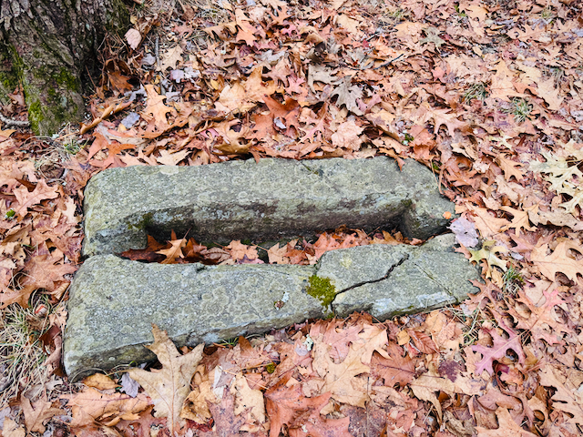

# The Lord’s Stone

The inscription of the Lord’s Stone of Harvard read:
“For the healing of the Nations, who shall here seek my favor. And I will pronounce all people who shall come to this fountain, not to step within this enclosure, nor place their hands upon this stone while they are polluted with sin. I am God the Almighty in whose hands are judgment and mercy. And I will cause my judgments to fall upon the willful violator of my commands in my own  time according to wisdom and truth, whether in this world, or in Eternity. For I have created all souls, and unto me they are accountable. Fear ye the Lord.”

On the other side was inscribed:

“Written and placed here by the Command of our Lord and Saviour Jesus Christ
THE LORD’S STONE
Erected on this Holy Hill of Zion
November 23rd, 1843
Engraved at Harvard”

In 1853, an order was issued from the church leadership in New Lebanon, NH to end  outdoor worship. As such, each Shaker community hid or destroyed its stone. 

The present location of the Harvard Lord’s Stone is unknown.

