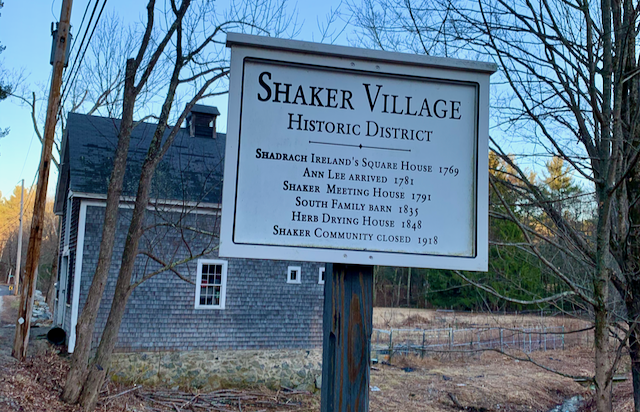

## A Natural History of my neighborhood in Harvard, MA

## Introduction

A few months ago, I came across [Circling Home by John Lane](https://muse.jhu.edu/pub/164/monograph/book/11978). The book described a personal project of his to learn everything about the home, neighborhood, and town that he had made a conscious decision to settle in. He drew a circle with a one mile radius around his home on a map and used that as the boundary for his investigations. This research would eventually become the book.

I really the idea. It resonates with me on two levels:

First, every few years, I pick a research topic to "go deep" in and learn everything I can about. I typically collect all of that information, analysis, and data and build an extensive set of notes, articles, and diagrams. Over the past three decades, topics have included: comparative religion, neuroscience, post-Soviet international relations, the American revolution, geology, astrophotography, AI and data science, climate change, lunar science.

Second, I love the town that I live in: the small town of Harvard, MA. I've already been accumulating articles and web links and local histories of my immediate environs. I've already been capturing photos of the plants and trees and insects in my area. I've been downloading topographic maps and geology articles of the area.

And so I've already started my next research project. I will learn all that I can about my neighborhood -- the Shaker Village Historic District.

I'll document my findings and notes and discoveries here. 

I'm tentatively calling this a "natural history of my neighborhood in Harvard, MA." The term "natural history" has a fairly wide range of definitions. The trend in recent years has only seen that trend continue. On wikipedia, I came across a recent definition by Barry Lopez that really resonated with my goal for this effort: the "patient interrogation of a landscap." Yes, that.

## Categories

* [Places](Places)
* [Geology](Geology)
* [Flora and Fauna](Flora and Fauna)

compiled by jefferson burson